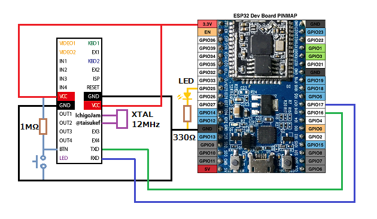
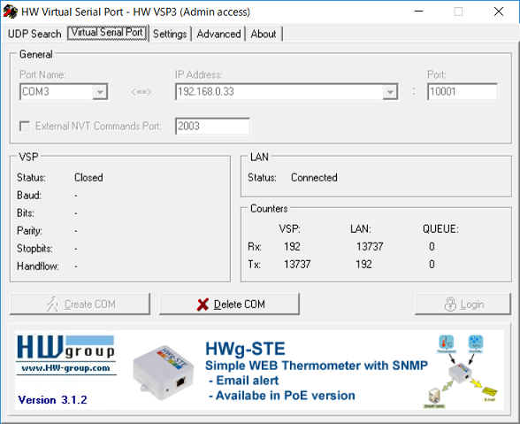

# ESP32_IchigoLatte_IJU
IJUtilitiesをIchigoLatteにTCPで接続できるようにします。  
### 必要な物 ###
* IchigoLatte、またはIchigoLatteファーム書き込み済みのLPC1114FN28 
* ESP32-DevKitC 
* [IJUtilities](http://ijutilities.micutil.com "Title")
* [HW VSP3 - Virtual Serial Port](http://www.hw-group.com/products/hw_vsp/index_en.html "Title")
* Arduino IDE (1.8.2で動作確認をしました。) 
* [Arduino core for ESP32 WiFi chip](https://github.com/espressif/arduino-esp32 "Title")
* [QueueArray Library For Arduino](http://playground.arduino.cc/Code/QueueArray "Title") 

### 配線(LPC1114FN28を使った例) ###
  

### 使い方 ###
 1. スケッチのssidとpasswordを自分の環境に合わせて書き換えて下さい。 
 2. ESP32にスケッチを書き込み後、シリアルモニタを開くとIPアドレスとポート番号が表示されるのでメモしておいて下さい。
 3. ESP32を起動し、HW VSP3でESP32のIPアドレスとポート番号をCOMポートに割り当ててESP32に接続します。
  
 4. IJUtilitiesを起動し、HW VSP3で割り当てたCOMポートに接続します。
 5. 接続後IchigoLatteのBTNスイッチを押すと、IchigoLatteのシェルのプロンプトが表示されます。

---
IchigoLatte and MixJuice by na-s.jp (Natural Style Co. Ltd.) / PCN  
Michio OnoさんのMicJackのソースの一部を使わせて頂いております。 
IJUtilities and MicJack CC BY Michio Ono (Micono Utilities) <http://ijutilities.micutil.com> 
 
